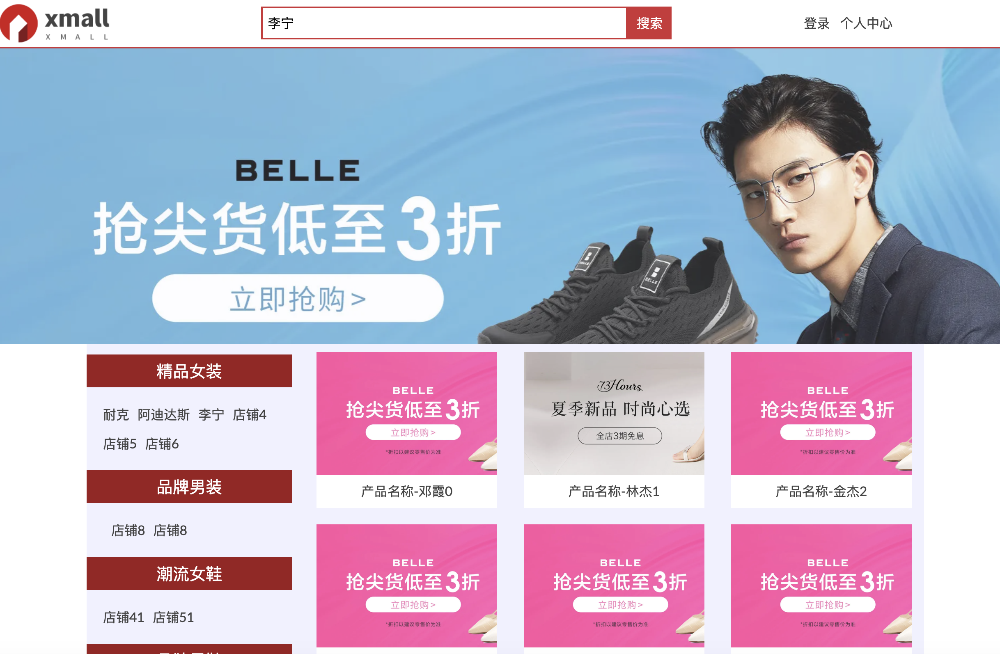
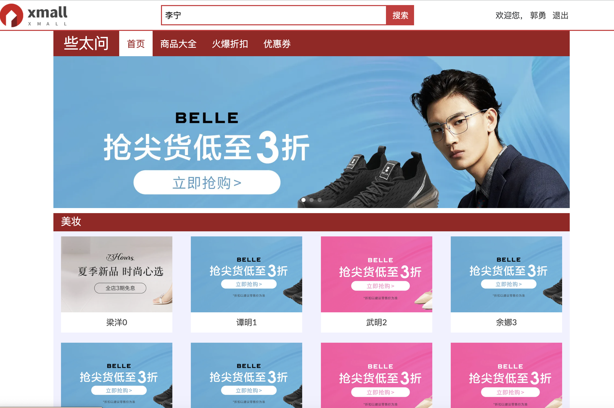
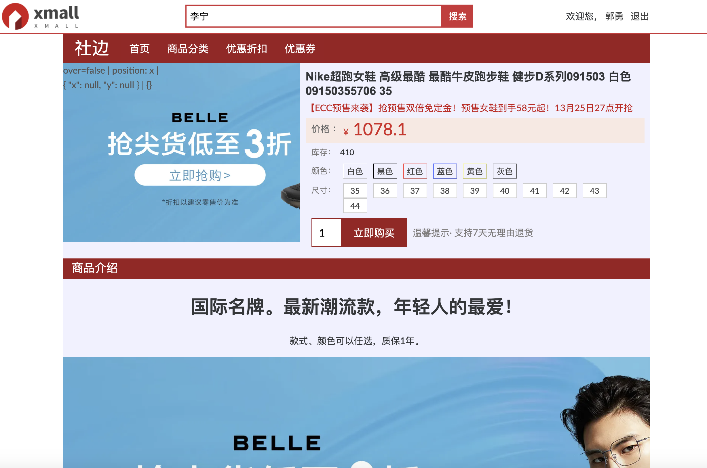

<div align="center">

<h1>example of Letjs</h1>
</div>

## 介绍
  这里基于Letjs工程搭建的例子，参考购物网站，提供首页 、列表页、商品页等，详细请查看DEMO。

#### 首页
  

#### 店铺页
  

#### 商品页
  

## 安装
```shell
  $ npm install
  $ npm run dev
```
